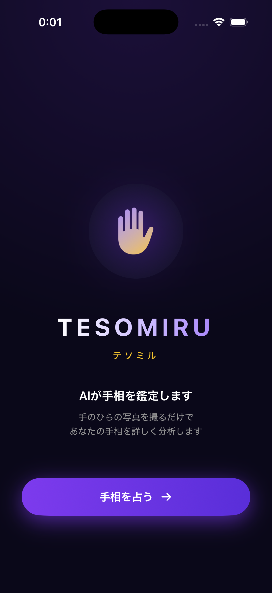
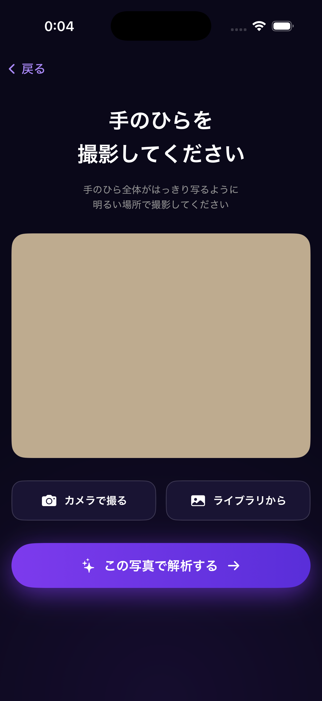
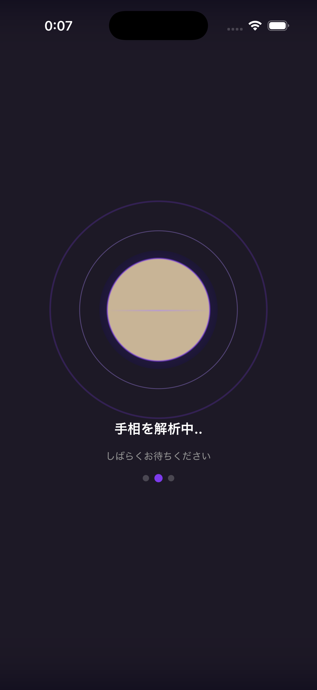
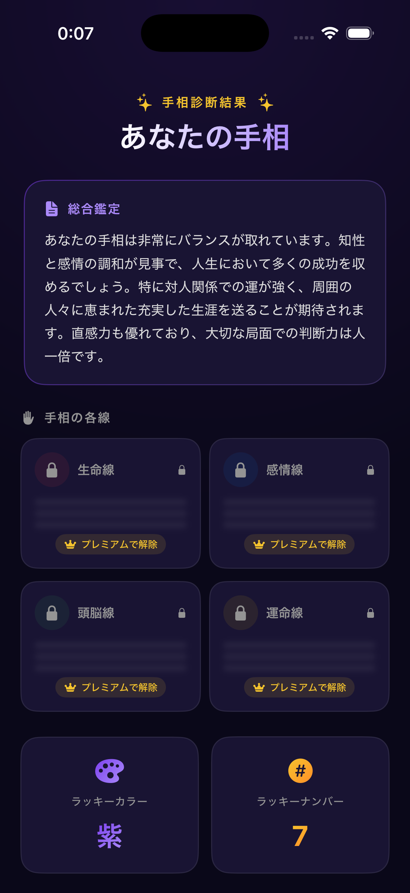

# 🖐 TESOMIRU（テソミル）

> AIが手のひらを読む。手相鑑定アプリ。

手のひらを撮影するだけで、AIが生命線・感情線・頭脳線・運命線を分析し、詳しい手相鑑定結果を表示するiOSアプリです。


---

## 📸 スクリーンショット

| ホーム | 撮影 | 鑑定中 | 結果 |
|---|---|---|---|
|  |  |  |  |

---

## ✨ 特徴

- **AIによる手相鑑定** — 手のひらの写真をサーバーに送信してAIが分析
- **4線を詳しく解説** — 生命線・感情線・頭脳線・運命線をスコア付きで表示
- **ラッキーカラー & ラッキーナンバー** — 鑑定結果に合わせて提示
- **洗練されたダークUI** — パープル×ゴールドのグラデーションデザイン
- **ペイウォール対応** — サブスクリプション機能付き

---

## 🛠️ 技術スタック

| カテゴリ | 技術 |
|---|---|
| 言語 | Swift 5.9+ |
| UI フレームワーク | SwiftUI |
| 最低対応 OS | iOS 17+ |
| 画像送信 | URLSession（multipart/form-data） |
| バックエンド | 自前APIサーバー（Node.js） |

---

## 📁 ディレクトリ構成

```
TESOMIRU/
├── TESOMIRU/
│   ├── TESOMIRUApp.swift        # エントリポイント
│   ├── ContentView.swift        # ルートView・画面遷移管理
│   ├── HomeView.swift           # ホーム画面
│   ├── CaptureView.swift        # カメラ撮影画面
│   ├── AnalyzingView.swift      # 鑑定中ローディング画面
│   ├── ResultView.swift         # 鑑定結果表示画面
│   ├── PaywallSheet.swift       # ペイウォール画面
│   ├── PalmReadingService.swift # API通信・レスポンス処理
│   └── Assets.xcassets/
├── TESOMIRU.xcodeproj/
├── screenshots/
└── .gitignore
```

---

## 🚀 セットアップ

```bash
# 1. リポジトリをクローン
git clone https://github.com/masafykun/TESOMIRU.git
cd TESOMIRU

# 2. Xcode で開く
open TESOMIRU.xcodeproj
```

> バックエンドAPIは別途必要です。開発時は `PalmReadingService.swift` の `analyzeMock()` をご利用ください。

---

## 🌐 バックエンド

手相画像は `multipart/form-data` 形式でAPIサーバーに送信され、AI（LLM）による分析結果がJSONで返されます。

```
POST /api/palm-reading
Content-Type: multipart/form-data

→ { summary, lines: [{ name, description, score }], luckyColor, luckyNumber }
```

---

## ライセンス

[](https://opensource.org/licenses/MIT)

このプロジェクトは **MIT ライセンス** のもとで公開しています。

© 2026 masafykun (https://github.com/masafykun)
